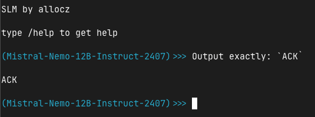

# SLM
## A suckless TUI LLM chat

Interact with multiple LLM models without leaving the terminal.

Works with any provider that supports the OpenAI API Schema.

Available flags:
```
Usage of slm:
  -api-endpoint string
        the chat completion API endpoint. ex: https://example.com/api/v1/chat/completions
  -api-key string
        the API key to authenticate with the LLM provider
  -model string
        the name of the model to be used (check your LLM API provider)
  -p string
        a prompt to be executed
```

Optional environment variables:
```
SLM_API_ENDPOINT=https://example.com/api/v1/chat/completions
SLM_API_KEY=your_api_key
SLM_MODEL=name_of_the_model
```



* Build
```bash
go build .
```

* Run
```bash
./slm
```
